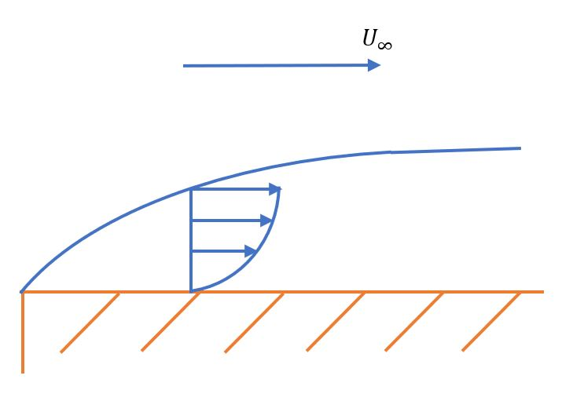
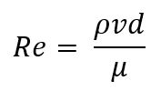

In order to begin to understand the complexities of designing a small UAV, it is important to first have some grasp of the fundamentals of the fluid (air) within which they operate. This page is a short guide to the most relevant principles, and is not meant to be a reference or comprehensive source for understanding fluid mechanics. It can, however, be a great starting point for understanding important concepts. These concepts will help you to have a basic idea of what is really going on in flight and to develop your own intuition for making design decisions throughout your project.

## Fluid Flow
By definition, both gases and liquids are fluids. These are classified together since priniples of fluid mechanics apply to both accurately. Both gases and liquids have weaker molecular forces than solids, creating an indefinite shape and volume. It is typically taught that liquids have a definite shape, but this is incorrect since they can be compressed if enough pressure is applied. As a reference, air is about 22,000 times more compressible than water. The weaker molecular forces in all fluids allow them to move and create a flow through or around a volume (such as an airplane).

When a fluid flows, a no-slip condition is assumed wherever it contacts a solid. This means that the flow velocity of the fluid at any point it contacts a solid is zero. The velocity increases outward from the surface until it gets to the free stream velocity (U∞). This occurs in a quadratic fashion, as shown below. The portion of the flow that has a velocity profile is of particular interest to us because this is where the aircraft is dealing with aerodynamic forces. It is referred to as the boundary layer.

### The Boundary Layer
As a fluid flows past a solid, the boundary layer "sticks" to the surface, creating a layer of slower moving fluid around the solid. This layer is typically only a few millimeteres thick. It is generally accepted that the boundary layer ends when the fluid velocity is 0.99(U∞). As the fluid flows farther down the surface, the boundary layer grows in thickness. Each horizontal point along the boundary layer maintains a quadratic velocity profile, increasing in size with the thickness. The boundary layer continues to grow until either it separates from the surface or the surface ends. Much of aerodynamic design is focused on ensuring that the boundary layer stays attached to the airplane as much as possible.

Within the boundary layer, one of the main forces being dealt with is shear stress. This is essentially a force acting parallel to the surface whose magnitude depends on the rate at which the velocity is changing and properties of the fluid present. In the equation below, τ is the shear stress, µ is the dynamic viscosity of the fluid, u is the fluid velocity relative to the surface, and y is the perpendicular distance from the surface. As you can see, an increase in the rate at which the velocity changes with position would result in an increase in shear stress. This in turn causes an increase in parasitic drag on the airplane, which is comprised of skin friction and pressure drag. Further discussion on types of drag can be found in the section on performance.

{: .align-center}

### Laminar and Turbulent Flow
To delay boundary layer separation, it is desirable to maintain a laminar boundary layer for a portion of the airfoil, and then allow a transition to turbulent. Whether a fluid flow is laminar or turbulent depends upon a few different factors that are related in what is called the Reynolds number. The Reynolds number is a nondimensional parameter that is, on a fundamental level, the ratio of intertial to viscous forces in a fluid. In the equation below, &#x03C1; is the density of the fluid, v is the velocity, d is the characteristic length (chord for airfoils, mean aerodynamic chord for wings), and µ is again the dynamic viscosity. 

{: .align-center}

A smaller Reynolds number indicates that the flow is laminar, meaning it is steady, smooth, and mixes very little through intermolecular forces. A larger Reynolds number indicates that the flow is turbulent, meaning it is unsteady, disordered, and mixes rapidly. For external flow, the transition from laminar to turbulent flow occurs at a value of around 500,000. A typical small UAV will operate with a Reynolds number on the order of 10,000. For flow around an airfoil, both types of flow will be present.

## Airfoils in Fluids
An essential characteristic about fixed-wing UAVs is their ability to produce lift almost entirely from their shape. This is accomplished by the thin, cambered profile of the airfoils used in the lifting surfaces. An airfoil's shape produces lift due to some important principles of fluid flow that can be measured with reasonable accuracy by the Bernoulli Equation.

### The Bernoulli Equation
The fundamental governing equation of fluid mechanics is referred to as the Navier-Stokes Equation. This equation cannot be solved analytically, so a number of assumptions can be made under certain circumstances to produce the Bernoulli Equation. The assumptions are as follows:

1. Steady flow 
2. Incompressible fluid 
3. No heat transfer
4. Streamlines
5. Inviscid flow
6. No work is being done

These assumptions can be loosely true for a small UAV, or at least inconsequential enough that the assumption can be made. Let's go over a few of the less obvious assumptions. We are assuming that the air around the UAV is incompressible. Although some compression is likely taking place, compressibility drag doesn't become significant until about Mach 0.7. Streamlines are lines of fluid flow around an object, along which the Bernoulli Equation can be applied. Although it is not fully accurate to say the flow is inviscid (this would eliminate all viscous drag), we will still make this assumption to use the Bernoulli Equation. These assumptions and the others listed allow us to use the equation below for calculating properties of a fluid around an airfoil. For this equation, V is the local velocity, P is the local pressure, &#x03C1; is the fluid's density, g is the gravitational constant, and z is the local vertical position. 

{: .align-center}

### Lift and Drag
The Bernoulli Equation allows us to compare properties at different points along a streamline. This can be done around an airfoil, allowing us to determine a few important facts. When air flows over the top of an airfoil, we see a slight increase in vertical position and velocity, but a decrease in pressure. The exact opposite is true along the bottom of the airfoil, but to a lesser magnitude. This creates a net upward pressure gradient that produces what we refer to as lift. In the case of a symmetric airfoil (in level flight), the pressure change on each side is equal and opposite, creating a net zero pressure gradient and therefore no lift. 

